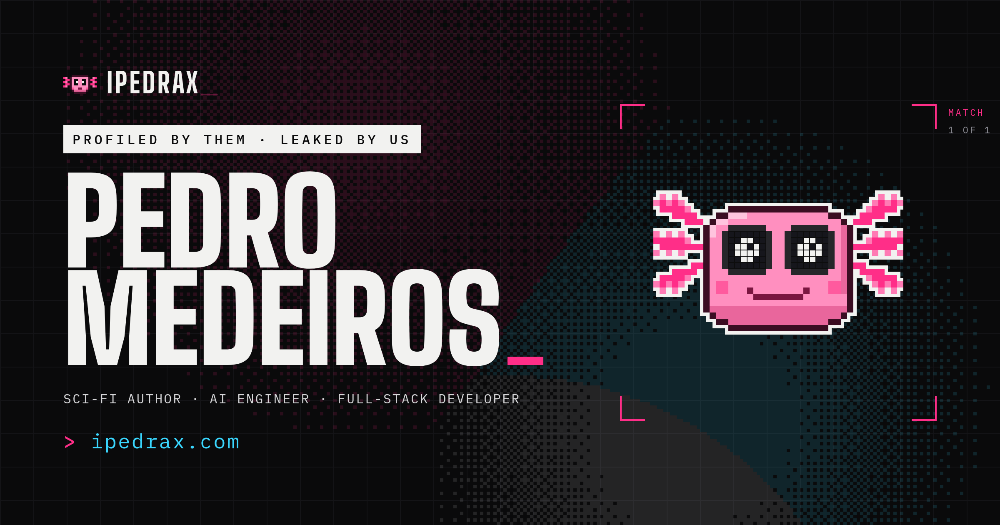

<a href="https://ipedrax.com"></a>

> **[> ipedrax.com](https://ipedrax.com)** &nbsp;·&nbsp; [interactive version](https://ipedrax.github.io/IPedrax/)


**Pedro Medeiros (IPedrax) is a Brazilian science-fiction author and AI engineer.**
He is the author of *The Harvest of Minds (A Colheita de Mentes)*, a cyberpunk novel,
and builds AI tools, autonomous agents and full-stack web applications. He studies
Computer Engineering at IFC and works as a freelance developer in Brazil.

Live apps, projects and writing: **[ipedrax.com](https://ipedrax.com)**

```
> PROFILED BY THEM · LEAKED BY US
> Sci-fi about a city that sells your mind. Software that won't:
> AI tools, security skills and full-stack apps, most of it open source.
```

---

## `> cat ./required_reading.md`

```
TITLE  : THE HARVEST OF MINDS · ECOS, VOL. 1
         (A Colheita de Mentes)
GENRE  : Cyberpunk / Science Fiction
SETTING: Dicotomia, a dystopian megacity split between the neon-drenched lower city and the corporate heights
STATUS : PUBLISHED
```

> Exploring memory, power, and forced evolution through a cast of augmented outcasts.

[](https://www.amazon.com.br/dp/B0GR9894D5)
[](https://www.amazon.com/dp/B0GR9MPRLR)

---

## `> cat stack.json`

| Layer | Stack |
|---|---|
| **Languages** | Python, TypeScript, JavaScript, Node.js, Bash, SQL |
| **AI** | Claude API, OpenAI API, Gemini API, LangChain, RAG, Prompt Engineering, Function Calling, Embeddings, Vector DBs, Fine-tuning, AI Agents, Tool Use |
| **Backends** | FastAPI, Express, REST APIs, GraphQL, WebSockets, SQLAlchemy, JWT Auth, OAuth2, Microservices, Webhooks |
| **Frontend** | React, Next.js, TypeScript, Vite, Tailwind, Recharts, PWA |
| **Databases** | SQLite, PostgreSQL, MongoDB, Redis, Pinecone, ChromaDB, Supabase |
| **Automation** | n8n, Evolution API, WhatsApp Bots, Web Scraping, Async Python, Celery, Cron Jobs, Zapier |
| **Cybersecurity** | Penetration Testing, API Security, OWASP Top 10, Auth Hardening, Brute-force Scripting, HTTP Interception, Recon & Enumeration, Rate Limiting, SQL Injection, Burp Suite, OSINT |
| **Infra / DevOps** | Docker, Docker Compose, Nginx, GitHub Actions, CI/CD, Linux, VPS, SSH |
| **ML / Data** | scikit-learn, Pandas, NumPy, NLP, Hugging Face, Linear Regression, Sentiment Analysis |

---

## `> ls -la ./proof_of_work`

### [AetherTable](https://ipedrax.com/rpg/) · AI Dungeon Master

> Play tabletop RPGs with an AI game master that narrates, remembers the campaign, and rolls real dice. Open source, bring-your-own-key.

- **Multi-provider**: Gemini, OpenAI, Ollama or LM Studio behind one interface; runs fully local if you want it to.
- **Persistent saga memory**: rolling summarization folds old turns into long-term memory so campaigns survive context limits.
- **Voice mode**: speech in, narrated speech out, over a WebSocket stream.
- **Real dice**: the model emits `[[ROLL:1d20+5]]` tags resolved by code, so it can never invent a number.

`FastAPI` `Gemini` `React` `TypeScript` `PostgreSQL` `WebSockets` `Docker`

[](https://github.com/IPedrax/AetherTable)

---

### [MTG Stock Market](https://ipedrax.com/market/) · Arcane Exchange

> Full-stack Magic: The Gathering card price tracker. Think Bloomberg Terminal, but for cardboard.

- **Backend**: FastAPI + SQLAlchemy + SQLite. JWT auth, freemium roles, price history, news scraping, ML-based 7-day price predictions via scikit-learn.
- **Frontend**: React + TypeScript dashboard: trending cards, portfolio tracker, price alerts, community comments, Pro-only AI recommendations engine.
- **Infra**: fully Dockerized (per-service Dockerfiles + docker-compose). PWA-ready with Workbox service worker.

`FastAPI` `SQLAlchemy` `scikit-learn` `React` `TypeScript` `Docker`

---

### [Windows Back Catalog](https://github.com/IPedrax/WindowsBackCatalog) · Every Windows ISO, Back in the Dropdown

> Microsoft still hosts the ISO for every Windows release it ever shipped. The download page just stopped listing them. This puts them back.

- One console snippet, or a bookmarklet, rewrites the edition dropdown on Microsoft's own download page with the product-edition IDs it quietly stopped listing.
- **Windows 7 SP1, 8.1, 10 22H2 and Windows 11 24H2/25H2** in x64 and Arm64, straight from Microsoft's CDN: no third-party mirror, no torrent, no bundled "activator".
- **Not a downloader and not a bypass**: it only repopulates a `<select>` and fires a `change` event; Microsoft's own flow issues the signed link.
- Documents what will bite you: VPN and datacenter IPs get refused, links expire in 24 hours, and an ISO is still not a licence.

`JavaScript` `Bookmarklet` `DevTools`

---

### [MoneyControl](https://ipedrax.com/moneycontrol/) · Personal & Business Finance

> Mission control for money: personal budgets, savings goals and business invoicing in one dark-first cockpit.

- Accounts, transactions, budgets, goals and recurring expenses, split across personal and business scopes.
- Client directory, invoicing and line items for the freelance side of the ledger.
- Shared single sign-on with the rest of the platform; every query scoped by owner.

`Express` `TypeScript` `Drizzle` `PostgreSQL` `React` `Zod` `Docker`

---

### [Dopamine](https://ipedrax.com/dopamine/) · Shopping Simulator

> The experience of online shopping, without spending real money.

- Thousands of real products across four parody marketplace skins, with a full cart and "checkout" flow.
- **Hard safety invariant**: no payments, no personal data, no real purchases, enforced by a `connect-src 'self'` CSP that blocks every off-origin request at the browser level.
- Offline-capable: ships with a bundled catalog seed and needs no external API to run.

`React` `TypeScript` `Vite` `CSP` `Docker`

---

### [Link Shortener & QR Generator](https://ipedrax.com/shortener/) · Free, No Account

> Paste a URL, get a short link and its QR code in one step. No account, no ads, no tracking pixels.

- Custom aliases, click counts, and a delete token that is the only proof of ownership (no accounts to breach).
- Generated share cards name the **real destination**, because a shortener that hides where it goes is a phishing tool.
- Rejects every scheme but `http`/`https`, rate limited per address.

`FastAPI` `PostgreSQL` `segno` `Pillow` `Docker`

---

## `> ls -la ./arsenal`

Claude skills and tooling, all public. No black boxes: read every line.

| Repo | What it does |
|---|---|
| [AetherTable](https://github.com/IPedrax/AetherTable) | Multi-provider AI Game Master for tabletop RPGs |
| [OmniSkill](https://github.com/IPedrax/OmniSkill) | 49 specialist skills across 7 departments, behind one router |
| [CyberSECC](https://github.com/IPedrax/CyberSECC) | Full-spectrum security: audit, red/blue team, CTF, reporting |
| [Storytelling](https://github.com/IPedrax/Storytelling) | Worldbuilding and fiction companion backed by an Obsidian vault |
| [llm-council](https://github.com/IPedrax/llm-council) | Run a decision past a council of AI advisors that peer-review each other |
| [motion-ui](https://github.com/IPedrax/motion-ui) | Framer Motion / GSAP / anime.js / Three.js animation engineering |
| [OSINT](https://github.com/IPedrax/OSINT) | Scoped open-source intelligence with graded findings and provenance |
| [Obsidian](https://github.com/IPedrax/Obsidian) | Persistent file-based memory vault for agents |
| [color-analysts](https://github.com/IPedrax/color-analysts) | 12-season personal colour analysis from a photo |
| [MTG-Card-Downloader](https://github.com/IPedrax/MTG-Card-Downloader) | Bulk Magic card image and data acquisition |

---

## `> cat clients.log`

Shipped for paying clients:

- **[Talent ADS](https://talentads.com.br)**: HR talent-intelligence SaaS. Three dashboards (company, candidate, headhunter) on one backend: AI CV-vs-vacancy scoring with skills/culture/seniority radars and salary valuation, batch upload and side-by-side comparison, AI interview questions, credit-based token billing. `React` `TypeScript` `Express` `n8n` `Docker`
- **[Talent Summit](https://talentsummit.com.br)**: event platform for Congresso Talent Intelligence Brasil: registration, exhibitor pages, admin CRM, n8n email campaigns
- **[A Toca BCG](https://atocabcg.com.br)**: trading-card game storefront
- **[E.C Estrategia Criativa](https://ecagencia.com.br)**: advertising agency site
- **[La Crochet](https://lacrochet.com.br)**: handmade crochet storefront with Mercado Pago checkout
- **[MontSerrat Cervejaria](https://cervejariamontserrat.com.br)**: craft brewery and mountain restaurant: table booking on a map of the dining room, customer accounts, and a staff panel for the menu, events, brewery tours and email campaigns. `Next.js` `SQLite` `Docker`

---

## `> cat other_work.log`

```
> AI chatbot backends     : multi-tenant Claude/OpenAI assistants with memory, tool use, webhook delivery via FastAPI
> WhatsApp AI agents      : autonomous sales/support bots using Evolution API + n8n + LLM routing for Brazilian SMBs
> RAG pipelines           : document ingestion, chunking, embedding, semantic search (ChromaDB / Pinecone)
> Full-stack SaaS MVPs    : end-to-end builds: auth, billing, dashboards, REST APIs, Docker, spec to production
> API penetration testing : async brute-force scripting, endpoint recon, auth bypass, vulnerability reporting
> Automation pipelines    : n8n workflows connecting CRMs, email campaigns, webhooks, and third-party APIs
> LLM prompt engineering  : system prompt design, few-shot tuning, structured output schemas, eval harnesses
> Data scraping           : async Python scrapers, headless browser automation, structured data pipelines
```

---

## `> open --backchannel`

```
> SLIPPING PAST THE WATCHERS...
> CHANNEL CLEAN. NOBODY'S LISTENING.
> Your move_
```

[](mailto:pedro.medeiros@ipedrax.com)
[](https://github.com/IPedrax)
[](https://www.99freelas.com.br/user/ipedrax)
[](https://twitter.com/ipedrax)

---

<sub>SYSTEM.HALT() => © 2026 PEDRO MEDEIROS · DICOTOMIA AWAITS</sub>
